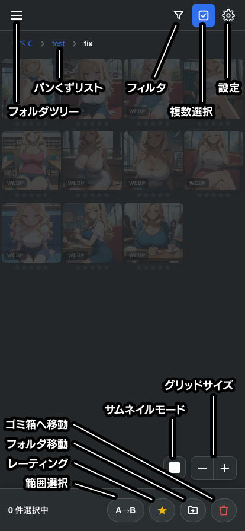

# Mobile Eagle

[日本語](README.md) | [English](README_en.md)

Eagle のライブラリをスマートフォンから閲覧するための Eagle プラグインです。

インストールはプラグインファイルをダブルクリックするだけです。

スマホのブラウザから LAN または VPN（Tailscale など）経由でアクセスして、画像の閲覧・評価・タグでの絞り込み・フォルダ移動・削除ができます。

日本語・英語に対応しています（ブラウザの言語設定から自動判定）。

<table>
  <tr>
    <td></td>
    <td></td>
    <td></td>
  </tr>
</table>

## 主な機能

### フォルダ移動に対応

一覧で複数の画像を選択し、移動先フォルダを選ぶと Eagle のライブラリが更新されます。

> 移動は「置換」です。 
> 複数フォルダに属していた画像も、移動後は移動先フォルダ 1 つだけに所属します

### 未分類フォルダに対応

どのフォルダにも属していない画像だけを集めた「未分類」を、フォルダツリーの中に表示します。

移動先として「未分類」を選ぶこともできます。この場合、選択した画像は所属フォルダをすべて外され、未分類の状態になります。

### 画像一覧

- 無限スクロールで全件表示
- グリッドのサイズを変更（画面下部のコントローラー）
- サムネイルの表示方法を正方形トリミング／全体表示で切り替え
- パンくずリストで上の階層へ戻る（フィルタ条件は維持されます）
- Eagle 側で画像を追加・削除すると一覧を自動更新（既定 10 秒間隔。無効も選べる）

### 絞り込み

- 評価（☆0〜★5 の複数選択）
- 拡張子（複数選択）
- キーワード（対象はファイル名とメモ。空白区切りは AND）
- タグ（「,」区切りで複数指定・AND）

フォルダを移動しても絞り込み条件は維持されます。

### 複数選択と一括操作

ヘッダーの複数選択ボタンから選択モードに入ります。

- A→B 範囲選択（始点と終点をタップして間をまとめて選択）
- 一括レーティング
- 一括フォルダ移動
- 一括削除（Eagle のゴミ箱へ移動）

### 画像の拡大表示

- 画面の左右、または画面下のサムネイルをタップすると前後の画像へ移動
- 大きい画像は JPEG に圧縮して配信（上限サイズ・圧縮率は設定で変更可能）
- 画像タップで Eagle に登録したメモを表示（PNG Info ではありません）
- **Copy Prompt**：メモに保存された生成情報から、ポジティブプロンプトだけをコピー
  - 行頭の `Negative prompt:` を区切りとする A1111 形式に対応

### 設定

- テーマ：ライト / ダーク / 自動（OSの設定）
- 自動更新：有効 / 無効
- 自動更新間隔（秒）：指定した間隔で自動更新します。規定は`10`
- ファイルサイズ上限（KB）：この画像より大きい画像は圧縮されます。規定は`768`
- JPEG 圧縮率：ファイルサイズ上限を超えた画像の圧縮率。規定は`85`

## できないこと

- ゴミ箱の閲覧・復元（Eagle のプラグイン API が未対応のため。ゴミ箱への移動は可能）
- タグの編集、メモの編集
- 画像の追加・インポート

## 動作環境

- Eagle 4.0 Build 22
  - https://eagle.cool/
- 外出先から見る場合は VPN が必要です
  - Tailscale がおすすめです https://tailscale.com/

Eagle 本体のプロセス内でサーバーが動くため、**OS のファイアウォール許可ダイアログは表示されません**。
Python や Node.js を別途インストールする必要もありません。

## インストール

1. [リリースページ](https://github.com/da2el-ai/mobile-eagle/releases)から最新の `Mobile-Eagle.eagleplugin` をダウンロードします
2. ファイルをダブルクリックすると Eagle のインストール確認が表示されるので、インストールします

## 使い方

### 1. サーバーを起動する

Eagle のプラグインパネルから Mobile Eagle を開くと、設定ウィンドウが表示されます。

| 項目 | 内容 |
| --- | --- |
| 最上部のスイッチ | サーバーの起動・停止を行う |
| IP アドレス | QR コードとアクセス URL に使う IP を選択する |
| ポート番号 | 既定は 8000 |
| パスワード | 空欄なら認証なし。英数記号のみ 128 文字まで |
| 保存ボタン | IP・ポート・パスワードをまとめて確定 |

- サーバーは `0.0.0.0` で待ち受けるため、PC が持つすべての IP アドレス（LAN・Tailscale など）で同時にアクセスできます
- IP アドレスの選択は QR コードに載せる URL を決めるだけのものです
- **ウィンドウを閉じてもサーバーは終了しません。** 停止したいときはスイッチを OFF にしてください
- 設定は保存され、次回以降は Eagle の起動と同時にサーバーが立ち上がります

### 2. スマホからアクセスする

表示された QR コードを読み取るか、`http://{選択した IP アドレス}:{ポート番号}` をブラウザで開きます。

パスワードを設定している場合は、最初に認証ダイアログが表示されます。 
一度ログインすれば 30 日間は再入力が不要です（パスワードを変更すると、その時点で全端末が再ログインになります）。

## セキュリティについて

個人が VPN・LAN 内で使うことを前提としたツールです。以下の割り切りをしています。

- 通信は HTTP（暗号化なし）
- パスワードは Eagle 内に平文で保存
- サーバーは LAN 上のすべての端末から到達可能。**インターネットに直接公開しないでください**

なお、PC 自身（localhost）からのアクセスは認証を免除しています。

## ライセンス

MIT
