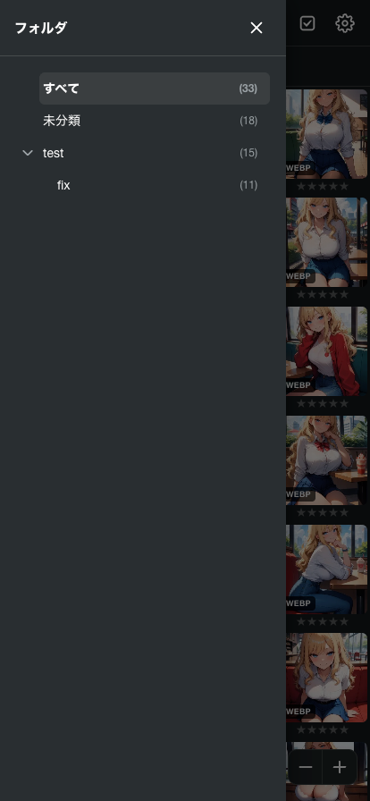
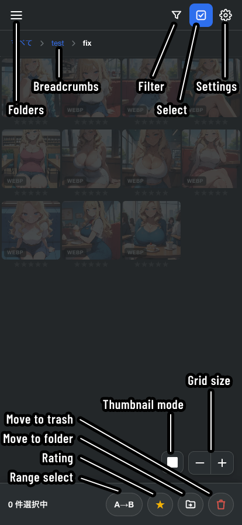
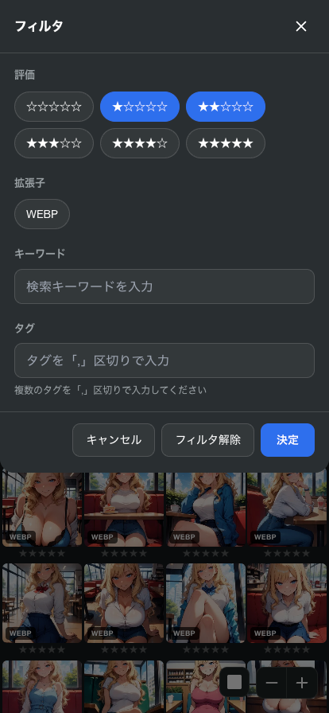
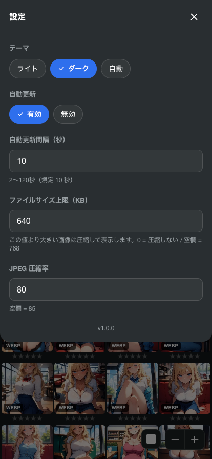
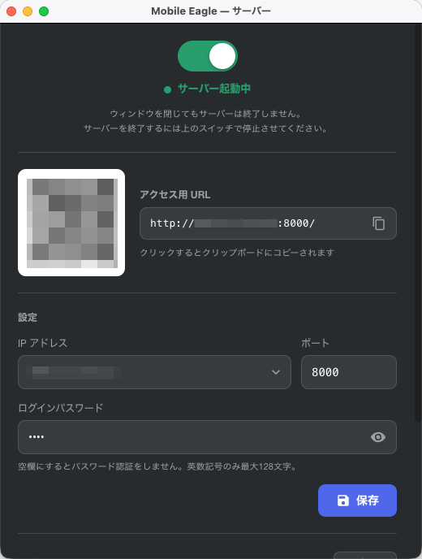

# Mobile Eagle

[日本語](README.md) | [English](README_en.md)

An Eagle plugin for browsing your Eagle library from a smartphone.

Installing it is just a matter of double-clicking the plugin file.

Access it from your phone's browser over your LAN or a VPN (such as Tailscale) to view images, rate them, filter by tags, move them between folders, and delete them.

Japanese and English are supported (detected automatically from your browser's language setting).

<table>
  <tr>
    <td></td>
    <td></td>
    <td></td>
  </tr>
</table>

## Features

### Moving images between folders

Select multiple images in the list and pick a destination folder, and your Eagle library is updated.

> A move is a **replacement**. 
> Even if an image belonged to several folders, after the move it belongs only to the destination folder

### Uncategorized folder

"Uncategorized", which collects only the images that belong to no folder at all, is shown inside the folder tree.

You can also pick "Uncategorized" as a destination. In that case the selected images are removed from every folder they belong to and become uncategorized.

### Image list

- Infinite scroll shows every image
- Change the grid size (controller at the bottom of the screen)
- Switch how thumbnails are displayed between square crop and whole image
- Go back up the hierarchy with the breadcrumbs (filter conditions are kept)
- The list refreshes automatically when you add or delete images in Eagle (every 10 seconds by default; can be turned off)

### Filtering

- Rating (choose any combination of 0–5 stars)
- File type (multiple choices)
- Keyword (searches the file name and the annotation; space-separated words are ANDed)
- Tags (separate multiple tags with ","; ANDed)

Filter conditions are kept when you move to another folder.

### Multi-select and bulk actions

Enter selection mode from the multi-select button in the header.

- A→B range selection (tap the start and the end to select everything in between)
- Bulk rating
- Bulk folder move
- Bulk delete (moves to Eagle's trash)

### Enlarged view

- Tap the left or right side of the screen, or a thumbnail at the bottom, to move to the previous or next image
- Large images are compressed to JPEG before being served (the size limit and the quality can be changed in the settings)
- Tap the image to show the annotation you registered in Eagle (this is not PNG Info)
- **Copy Prompt**: copies only the positive prompt out of the generation info saved in the annotation
  - Supports the A1111 format, which uses a line starting with `Negative prompt:` as the delimiter

### Settings

- Theme: Light / Dark / Auto (follows the OS setting)
- Auto refresh: On / Off
- Refresh interval (seconds): refreshes at the interval you specify. Default is `10`
- File size limit (KB): images larger than this are compressed. Default is `768`
- JPEG quality: the quality used for images that exceed the file size limit. Default is `85`

### Reloading the library

When the same library on a NAS is opened in Eagle on several devices, changes made on another device (adding or deleting images, etc.) may not show up.
In that case, run "Reload library" at the bottom of the settings screen.
It reloads the library in the same way as "Empty cache and reload" in the Eagle menu.

- The elapsed time is shown while it runs, and the list is updated when it finishes
- Depending on the size and location of the library, it can take a few minutes (about 5 minutes for about 28,000 items on a NAS)
- It relies on an undocumented part of Eagle, so it may stop working after an Eagle update.
  If it does not work, run it from the Eagle menu instead

## What it cannot do

- Browsing or restoring the trash (Eagle's plugin API does not support it. Moving to the trash is possible)
- Editing tags or annotations
- Adding or importing images

## Requirements

- Eagle 4.0 Build 22
  - https://eagle.cool/
- A VPN is required to view your library away from home
  - Tailscale is recommended: https://tailscale.com/

Because the server runs inside Eagle's own process, **the OS firewall permission dialog is never shown**.
You also do not need to install Python or Node.js separately.

## Installation

1. Open the releases page
   - https://github.com/da2el-ai/mobile-eagle/releases
2. In the latest release at the top (the one with `Latest` shown next to the version number), click `Mobile-Eagle.eagleplugin` under **Assets** to download it
   - `Source code (zip)` / `Source code (tar.gz)` are the source code, so you do not need to download them
3. Double-click the downloaded `Mobile-Eagle.eagleplugin`
4. Eagle shows an install confirmation for the plugin — go ahead and install it

Once it is installed, continue to "Usage" below.

## Usage

### 1. Start the server

Open Mobile Eagle from Eagle's plugin panel and the settings window appears.

| Item | Description |
| --- | --- |
| Switch at the top | Starts and stops the server |
| IP address | Chooses the IP used for the QR code and the access URL |
| Port number | 8000 by default |
| Password | Blank means no authentication. Alphanumerics and symbols only, up to 128 characters |
| Save button | Confirms the IP, port and password together |

- The server listens on `0.0.0.0`, so it is reachable at every IP address the PC has (LAN, Tailscale and so on) at the same time
- Choosing an IP address only decides which URL goes into the QR code
- **Closing the window does not stop the server.** Turn the switch off when you want to stop it
- Your settings are saved, so from the next time on the server starts together with Eagle

### 2. Access it from your phone

Scan the QR code that is shown, or open `http://{the IP address you chose}:{port number}` in your browser.

If you have set a password, an authentication dialog appears first. 
Once you log in you will not be asked again for 30 days (changing the password logs every device out at that moment).

## About security

This is a tool meant for personal use inside a VPN or a LAN. It makes the following trade-offs.

- Traffic is plain HTTP (not encrypted)
- The password is stored in plain text inside Eagle
- The server is reachable from every device on the LAN. **Do not expose it directly to the internet**

Note that access from the PC itself (localhost) is exempt from authentication.

## License

MIT
